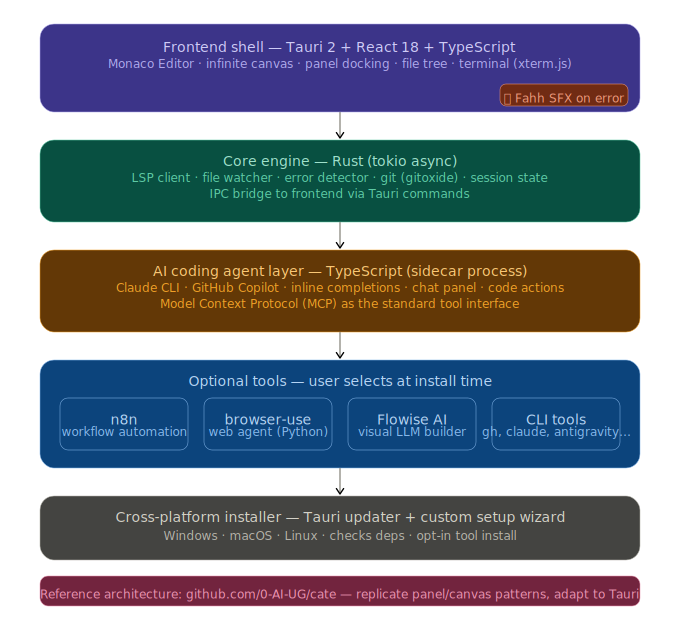

# Fahh Editor

> The VS Code killer with meme power. Make an error. Hear the consequences.



Fahh Editor is a fast, cross-platform desktop IDE built with Tauri 2 and React.
It has full LSP support, an integrated terminal, git sidebar, AI coding agent,
and one very important feature: every time your code has an error, it plays
[the sound](src-tauri/assets/fahhhh.mp3).

---

## Features

- **Monaco Editor** — same engine as VS Code, but ours
- **Fahh SFX** — compile error? LSP error? Build failure? You will hear it
- **LSP support** — rust-analyzer, pyright, typescript-language-server, clangd, and more, auto-detected on PATH
- **Integrated terminal** — xterm.js, multiple sessions, persistent history
- **Git sidebar** — stage, commit, diff, branch switcher, all without leaving the IDE
- **AI coding agent** — powered by MCP, works with Claude CLI, Copilot, or any MCP-compatible model
- **Infinite canvas** — drag editor tiles onto a zoomable workspace like a whiteboard
- **Optional tools** — n8n, browser-use, Flowise AI, GitHub CLI, Claude CLI, installed locally at first run with no Docker

---

## Quick start

### Requirements

- Rust 1.78+
- Node.js 20+ and pnpm 9+
- Tauri CLI 2: `cargo install tauri-cli --version "^2"`

**Linux only:**
```bash
sudo apt install libwebkit2gtk-4.1-dev libssl-dev libayatana-appindicator3-dev
```

### Run in development

```bash
git clone https://github.com/Arnav1771/fahh-ide
cd fahh-ide
pnpm install
pnpm tauri dev
```

### Build for production

```bash
pnpm tauri build
```

The installer is in `src-tauri/target/release/bundle/`.

---

## Optional tools

On first launch, a setup wizard asks which tools you want. All run locally
without Docker. You can re-run the wizard any time from Settings > Integrations.

| Tool | What it does |
|------|-------------|
| n8n | Visual workflow automation, runs at `localhost:5678` |
| browser-use | AI-powered web browser agent (Python) |
| Flowise AI | Visual LLM workflow builder, runs at `localhost:3001` |
| GitHub CLI | `gh` commands from the integrated terminal |
| Claude CLI | AI coding agent via Anthropic's Claude |

---

## Architecture

See [docs/ARCHITECTURE.md](docs/ARCHITECTURE.md) for the full breakdown.

The short version: Tauri 2 hosts a Rust backend (tokio async, LSP client,
file watcher, git via gitoxide) and a React frontend (Monaco, xterm.js, Zustand).
All AI tools connect through MCP so any model can plug in.

---

## The Fahh SFX

The `fahhhh.mp3` file is in `src-tauri/assets/`. It plays whenever:

- An LSP diagnostic error appears in an open file
- A build task fails
- A debug session crashes

There is a 3-second cooldown to prevent spam. You can disable the SFX in
Settings but you will be judged.

Full spec: [docs/FAHH_SFX.md](docs/FAHH_SFX.md)

---

## Documentation

- [ARCHITECTURE.md](docs/ARCHITECTURE.md) — tech stack and design decisions
- [FAHH_SFX.md](docs/FAHH_SFX.md) — the error sound system spec
- [INSTALLER.md](docs/INSTALLER.md) — optional tools installer internals
- [CONTRIBUTING.md](CONTRIBUTING.md) — how to contribute
- [CHANGELOG.md](CHANGELOG.md) — version history
- [CLAUDE.md](CLAUDE.md) — guide for AI coding agents working in this repo

---

## Contributing

See [CONTRIBUTING.md](CONTRIBUTING.md).

---

## License

MIT
